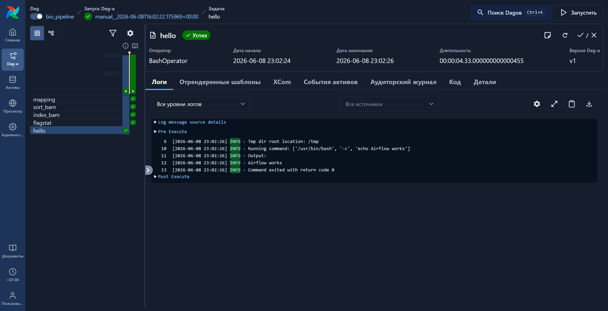
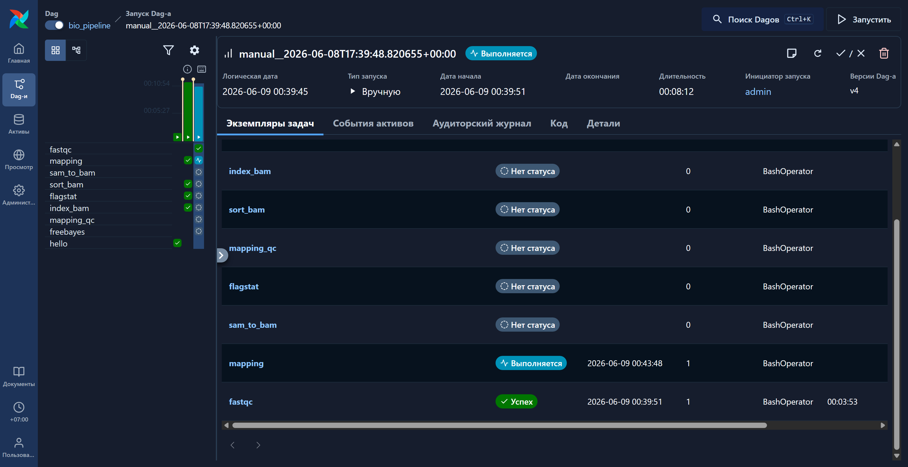
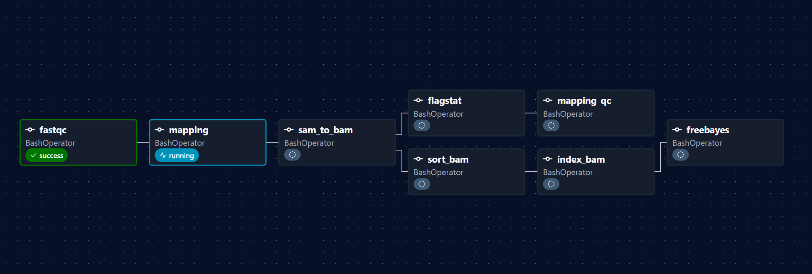

## ФИО: Односторонцева Евгения Максимовна, 23213

### 1. Ссылка на прочтения из NCBI 
https://www.ncbi.nlm.nih.gov/sra/SRX33790936

### 2. Скрипт на bash с реализованным алгоритмом
[Скрипт на bash с реализованным алгоритмом](scripts/mapping_qc.sh)

### 3. Результат команды samtools flagstat
[Результат команды samtools flagstat](qc/flagstat.txt)

### 4. Скрипт разбора файлов с этими результатами
[Скрипт разбора файлов с этими результатами](scripts/parse_flagstat.py)

### 5. Инструкцию по развертыванию и установке фреймворка
* pip install apache-airflow
* export AIRFLOW_HOME=$PWD/airflow
* airflow db migrate
* airflow standalone


### 6. Код любого тестового пайплайна (“Hello world”) на фреймворке
```
from airflow import DAG
from airflow.operators.bash import BashOperator
from datetime import datetime

with DAG(
    dag_id="hello_world",
    start_date=datetime(2025,1,1),
    schedule=None,
    catchup=False,
) as dag:

    hello = BashOperator(
        task_id="hello",
        bash_command="echo Airflow works"
    )
```

### 7. Результаты работы пайплайна на фреймворке и лог-файлы



### 8. Код пайплайна “оценки качества картирования” на фреймворке
[Код пайплайна “оценки качества картирования” на фреймворке](airflow/dags/bio_pipeline.py)



### 9. Выведенные результаты работы пайплайна на загруженных данных в отдельном файле
[результаты работы пайплайна](qc/flagstat.txt)

### 10. Лог-файлы работы пайплайна на загруженных данных
[Лог-файлы](airflow_logs.tar.gz)

### 11. Визуализацию пайплайна в виде графического файла



### 12. Описание использованного способа визуализации и отличия полученной визуализации от блок-схемы алгоритма в свободной форме
Для визуализации вычислительного процесса использовался встроенный механизм Apache Airflow (Graph View). В отличие от обычной блок-схемы алгоритма, визуализация Airflow отображает не только последовательность этапов обработки данных, но и их текущее состояние выполнения (успешно завершено, выполняется, ошибка, ожидание). Также отображаются зависимости между задачами и история запусков, что делает такую визуализацию удобным инструментом мониторинга вычислительных процессов.
